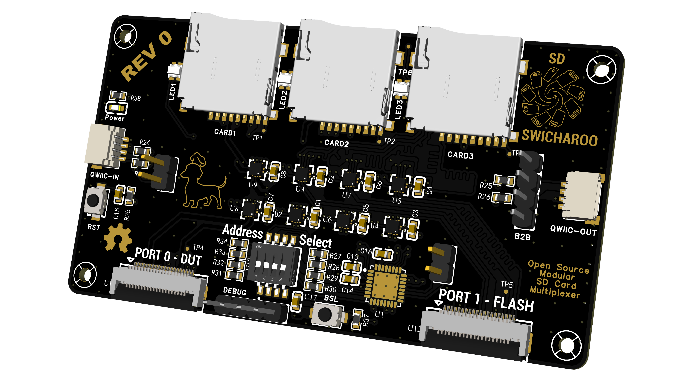
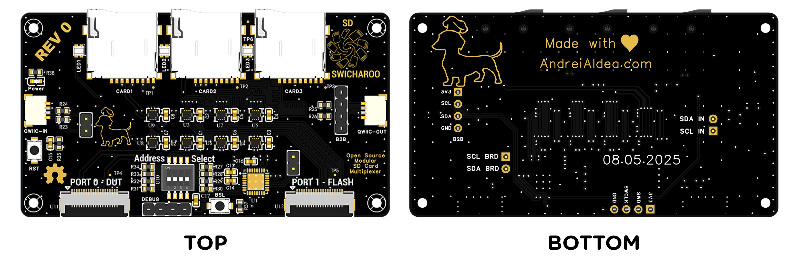
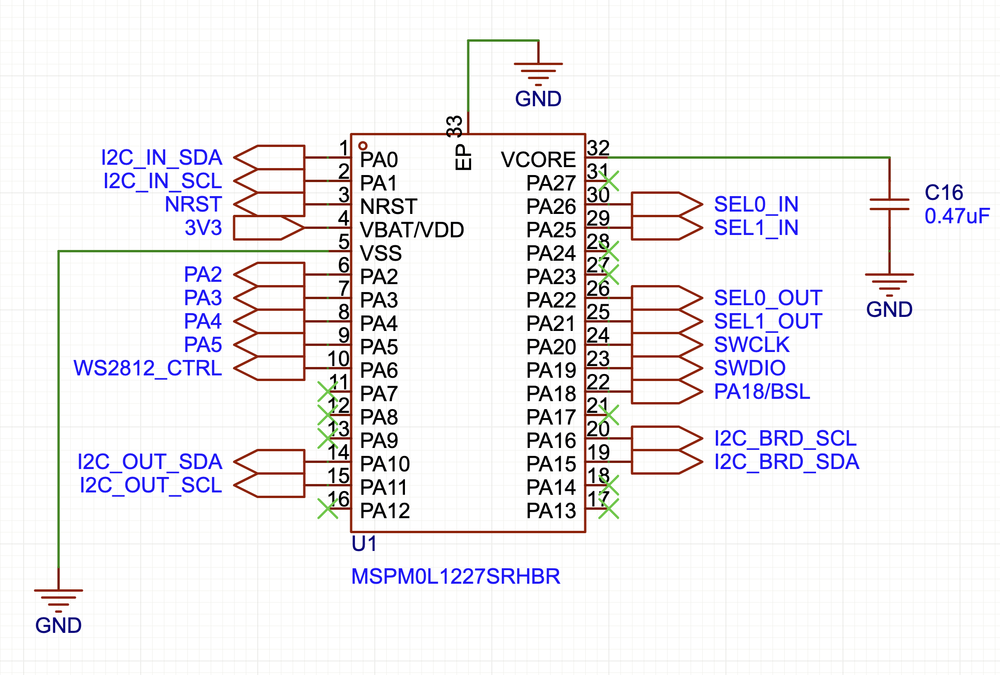
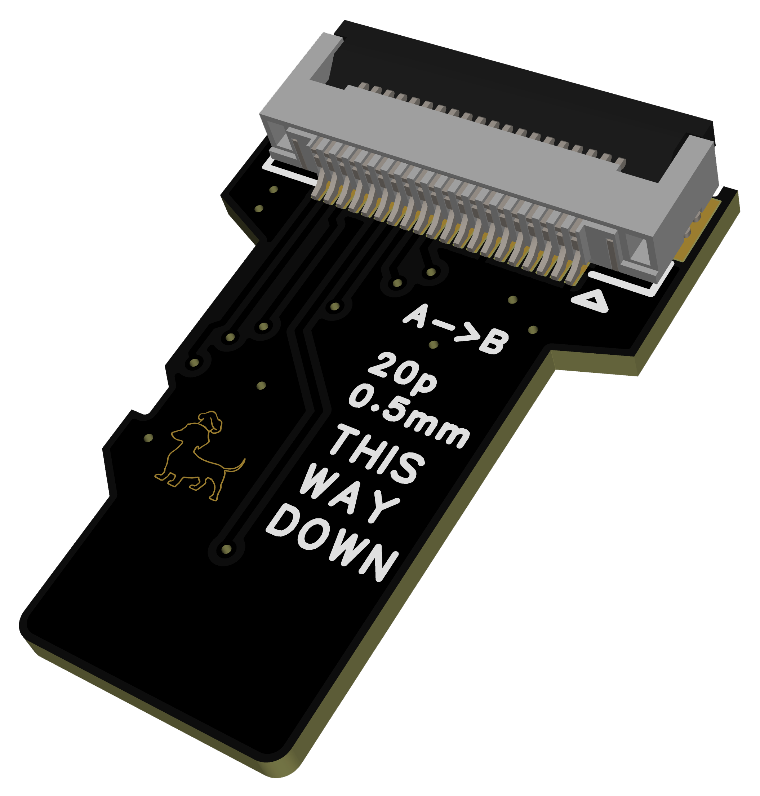

# SD Swicharoo: a modular SD card mux for embedded development

## WARNING - THIS IS A WORK IN PROGRESS AND NOT READY FOR PRODUCTION
I do not suggest making PCBs with the current design as it stands.

  

The SD Swicharoo is a versatile, open-source hardware development and test automation tool designed for embedded developers working with SD card interfaces. 

It acts as a switch and multiplexer, allowing any one of three (3) SD cards to be seamlessly switched between two different host devices. This eliminates the need for physically swapping the SD card, streamlining the development, testing, and debugging process for things like Single Board Computers.

## Key Features

- **Dual-Host Support:** Allows for flashing one card while the other is connected to your DUT (device under test)
- **Hot Spare:** Useful if an SD card becomes inoperable in cases where the board is installed remotely. Prevents downtime.
- **Hot-Swap Capability:** Switch between hosts without powering down the system.
- **Easy Integration:** Designed with standard pin headers for breadboard or direct PCB integration.
- **Modular Daisy-Chain Design:** Allows boards to be daisy-chained via QWIIC and/or stacked via standard 0.1" header.
  
## Use Cases

- **CI/CD Automation:** Integrate into automated test fixtures to cycle through different software configurations for reliability and compatibility testing.
- **A/B Testing:** Test the same software image between multiple boards
- **Automated Flashing:** Flash multiple SD cards in an automated fashion

## How it Works

  

The SD Swicharoo uses high-speed multiplexer ICs controlled by a MSPM0 microcontroller to connect one of two ports to any of 3 Micro SD cards. 

The SD Swicharoo presents itself as a simple I2C Device at address 0x5D (incrementable via dip-switch)

Once connected, it reponds to a simple set of commands (outlined below). This approach makes it easy to integrate into existing test automation systems and removes the need for complex control logic. 

Control examples are provided for -
- [ ] FTDI FT4232 (Libusb)
- [ ] Generic Linux I2C-Tools
- [ ] Tiva TM4C129 based TADA Board
- [ ] RP2040 Pi Pico

## Hardware 

  

## Pinout and Connections

The SD Swicharoo board features clear pin headers for easy connection to your embedded systems.

- `QWIIC IN:` **Main I2C Control port** - also intended to power the device
- `PORT 0 - DUT:` **Host Port 0** - intended for DUT
- `PORT 1 - FLASH:` **Host Port 1** - intended for SD card flasher (but is idential to Port 0 in functionality)
- `QWIIC OUT:` **Currently non-functional** - Mapped to second I2C Port of MSPM0, intended for daisy chaning. Future revisions may connect it directly to QWIIC_IN port to remove need for firmware based I2C forwarding. 
- `B2B:` **Identical to QWIIC OUT** - enables stacking boards in addition to daisy-chaining for compact setups. 

The MSPM0L1227 pinout is shown below:

  

#### For firmware development, the relevant pins are as follows -
* **PA0**  - `I2C_IN_SDA` - Main device I2C port
* **PA1**  - `I2C_IN_SCL`
* **PA26** - `SEL0_IN` - The 2 Control bits for the port selection of PORT 0 DUT port
* **PA25**- `SEL1_IN`
* **PA22** - `SEL0_OUT` The 2 Control Bits for port selection of PORT 1 FLASH port
* **PA21** - `SEL1_OUT` 
* **PA6**  - `WS2812_CTRL` - Control pin for the three (3) WS2812 Adressable Indicator LEDs of the MicroSD Card sockets
* **PA2/3/4/5** - Inputs tied to `ADDRESS SELECT` dip switches for setting the I2C Device Address of the device

## Getting Started

1.  **Insert Micro SD Cards:** Insert 1 to 3 micro SD cards you want to test.
2.  **Connections:** Connect `HOST_A` and `HOST_B` flat flex ribbon cables to the MicroSD footprint adapters. **Cables shorter than 15cm (150mm) are recommended.** 
3.  **Connect Controller Device:** Conect your host controller to the ``QWIIC IN`` port to power and control the device
4.  **Enjoy:** Start developing with the convenience of not having to physically swap your SD cards!
   

  

## MSP M0 Firmware Development

Initial CCS project provided above.

**Current FW Functionality** -
- [x] I2C Device Detection - 0x5D default address
- [x] Mux Logic - Port 0/1 to SD1/2/3 or Disconnected 
- [x] WS2812 LED Driver

**TODO** - 
- [ ] Actual I2C Device Responses
- [ ] User I2C Address Changes
- [ ] User LED Control
- [ ] I2C Forwarding
- [ ] Debug Logging
- [ ] Remove need for CCS

Docs coming soon...

## Software Examples

Comming soon...

## License

This project is licensed under the [GNU General Public License v3.0](https://www.gnu.org/licenses/gpl-3.0.en.html).
